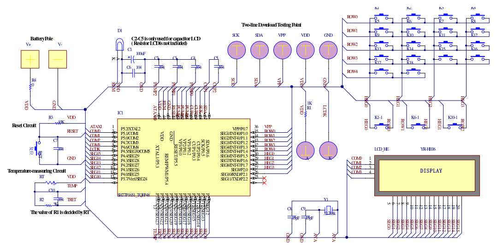
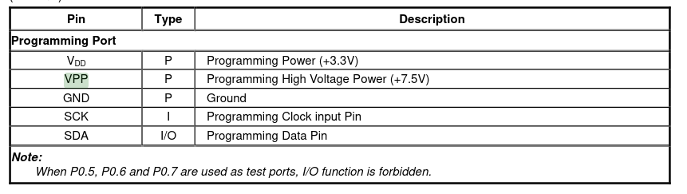

# Table of Contents

1.  [Resumo](#org86c2119)
2.  [Lâmpadas](#orga622a42)
    1.  [Descrição do circuito](#org859bfe0)
    2.  [Componentes utilizados (por lâmpada)](#orgcc33763)
3.  [Controle do ar condicionado](#orgc32b23b)
    1.  [Descrição do hardware](#org492999a)
    2.  [I2C revisão](#orgf99cb58)
4.  [Descrição do software](#orgd8a1f78)

# Resumo

Um projeto de automação residencial foi demandado. Para a minha casa, pretende-se usar os ESP8266 para cada tomada para poder ter conexão com o computador central (raspberry pi).
Eu vou me limitar ao backend senão o projeto vai ficar complicado demais.

# Lâmpadas

## Descrição do circuito

Um pequeno trafo recebe a energia da tomada, é retificada por uma ponte retificadora e então o módulo relé com o esp8266 controla o chaveamento da lâmpada. Não menos importante, o interruptor da tomada dever ser alimentado por um resistor, cujo estado é lido por uma porta digital. Quase esqueci dos sensores de presença. Devido ao espaço ocupado, novos interruptores devem ser comprados.
Sendo assim, o \(\mu C\) precisará de 3 portas digitais para controlar os periféricos e mais talvez duas para poder programar em ISP.
Pretendo não fazer placa de circuito impresso para simplificar o projeto e tb no momento é impossível para mim imprimir sem uma impressora adequada.

## Componentes utilizados (por lâmpada)

-   [X] 1 Trafo de carregador;
-   [X] 4 Diodos 1n4007;
-   [X] 1 Capacitor eletrolítico (47uF);
-   [X] 1 Capacitor cerâmico (100nF);
-   [X] 1 Sensor piroelétrico
-   [ ] 1 Conjunto de interruptor; (Precisa comprar)
-   [X] 1 Módulo de acionamento de relé por ESP8266 (figura \ref{fig:module_esp01})

O módulo de relé possui o esquemático como na figura \ref{schematic_relay}

# Controle do ar condicionado

## Descrição do hardware

O computador principal se conecta ao controle do ar condicionado através dos barramentos de I2C do display e do microcontrolador. O primeiro barramento seria usado para o computador central identificar as configurações atuais do ar condicionado e o segundo serve para fazer alterações nas configurações. Para tanto é preciso fazer uma revisão sobre o protocolo e interpretar os dados lidos.

## I2C revisão

Ao abrir o controle do ar condicionado foram encontrados os pinos 36,37,38 e 44 acessíveis ao usuário. Como mostrado na figura \ref{fig:i2c_sh77}. Claramente eles servem para estabelecer comunicação i2c entre o chip e um computador externo.

Fui procurar circuitos de controle remoto que aplicam este microcontrolador e achei um resultado interessante, como na figura \ref{fig:sh77_example}.

Logo fiquei na dúvida o que seria o VPP do pino 36, pesquisei no datasheet e achei este resultado (vide figura \ref{fig:vpp_meaning}).

Depois disso notei que precisava rever um pouco sobre i2c e achei as seguintes figuras chave:
TODO &#x2026;

# Descrição do software

Os esp8266 das tomadas devem entrar em um ponto de acesso central e então ficar à espera de comandos. Ele age como servidor para responder aos comandos do computador central, porém também irá enviar mensagens durante a comutação do sensor piroelétrico (descobrir se não vai haver realimentação positiva com a lâmpada)
Protocolo de comunicação:
Tem que descobrir uma forma de protocolar as mensagens. O receptor vai ler a mensagem e vai decodificá-la. Após decodificar, vai executar a ação de desligar/ligar.

USE o micropython, nada de C, para facilitar sua vida.

Procedimentos a serem utilizados na cpu principal:

-   get state() # Retorna o estado atual lâmpada;
-   get switch() # Retorna a posição do interruptor;
-   turn(boolean state) # Pede para ligar/desligar a lâmpada

