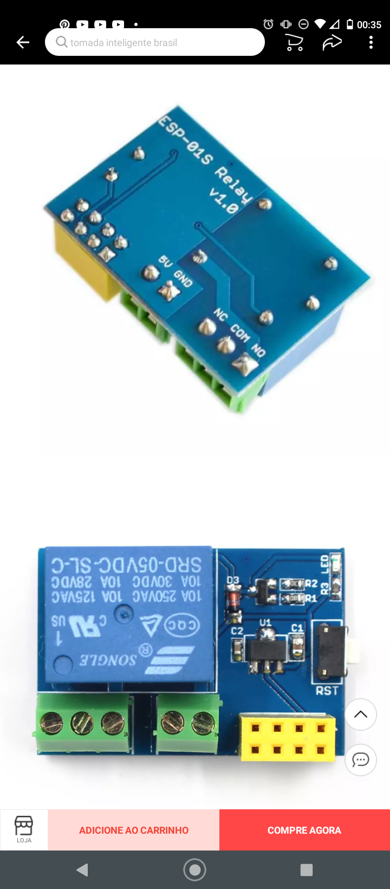

# Table of Contents

1.  [Motivação](#org07e5c31)
2.  [Objetivos](#orgdf78dd7)
3.  [Detalhamento do projeto](#org31b4d2c)
    1.  [Lâmpadas](#org730a659)
        1.  [Descrição do circuito](#org06eb5cb)
        2.  [Componentes utilizados (por lâmpada)](#orga90a668)
    2.  [Controle do ar condicionado](#org27f5784)
    3.  [Descrição do software](#orgb905f24)

# Motivação

Um projeto de automação residencial foi demandado. Primeira coisa que vem em mente é poder controlar as lâmdas de casa individualemente. Assim, pretende-se usar um ESP8266 para cada ponto de interruptor de lâmpada para poder ter conexão com o computador central (raspberry pi). Temos disponíveis sensores piroelétricos, que são úteis para desligar as lâmpadas automaticamente na ausência de pessoas no cômodo.

# Objetivos

Gerenciar o funcionamento das lâmpadas de casa, cujas ações de desligar ou ligar possam ser configuradas como automáticas (depende do sensor de presença) ou manuais (depende de comandos por smarthphone, sejam botões e/ou comandos de voz). Este gerenciamento também inclue a formação de relatórios sobre consumo elétrico (estimado) em cada dispositivo, apresentando as informações em histogramas e suas respectivas conclusões.
Um objetivo secundário seria implementar o controle de ar condicionado, em que a diferença para a lâmpada seria o controle (malha aberta) de temperatura e o registro da mesma no relatório.

# Detalhamento do projeto

## Lâmpadas

### Descrição do circuito

Um pequeno trafo recebe a energia da tomada, é retificada por uma ponte retificadora e então o módulo relé com o esp8266 controla o chaveamento da lâmpada. Não menos importante, o interruptor da tomada dever ser alimentado por um resistor, cujo estado é lido por uma porta digital. Quase esqueci dos sensores de presença. Devido ao espaço ocupado, novos interruptores devem ser comprados.
Sendo assim, o $\mu C$ precisará de 3 portas digitais para controlar os periféricos e mais talvez duas para poder programar em ISP.
Pretendo não fazer placa de circuito impresso para simplificar o projeto e tb no momento é impossível para mim imprimir sem uma impressora adequada.

### Componentes utilizados (por lâmpada)

-   [X] 1 Trafo de carregador;
-   [X] 4 Diodos 1n4007;
-   [X] 1 Capacitor eletrolítico (47uF);
-   [X] 1 Capacitor cerâmico (100nF);
-   [X] 1 Sensor piroelétrico
-   [ ] 1 Conjunto de interruptor; (Precisa comprar)
-   [X] 1 Módulo de acionamento de relé por ESP8266 (figura \ref{fig:module_esp01})

O módulo de relé possui o esquemático como na figura \ref{schematic_relay}

## Controle do ar condicionado

Decodificar o controle do ar condicionado com um fototransistor. Cada ação iria ser incorporada no código do raspberryPI e então através de um fotodiodo, o ar condicionado pode ser acionado.

## Descrição do software

Os esp8266 das tomadas devem entrar em um ponto de acesso central e então ficar à espera de comandos. Ele age como escravo para responder aos comandos do computador central e também irá enviar mensagens durante a comutação do sensor piroelétrico (descobrir se não vai haver realimentação positiva com a lâmpada)
Protocolo de comunicação:
Tem que descobrir uma forma de protocolar as mensagens. O receptor vai ler a mensagem e vai decodificá-la. Após decodificar, vai executar a ação de desligar/ligar.

Procedimentos a serem utilizados na cpu principal:

-   get state() # Retorna o estado atual lâmpada;
-   turn(boolean state) # Pede para ligar/desligar a lâmpada
-   get switch() # Retorna a posição do interruptor;

