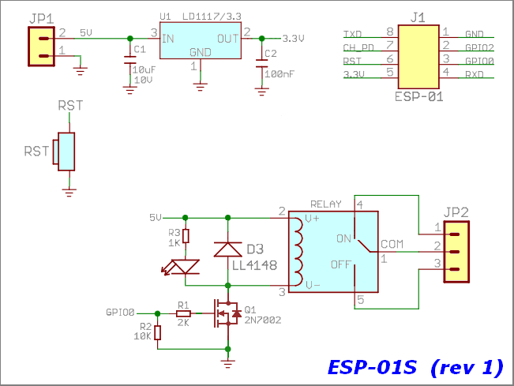
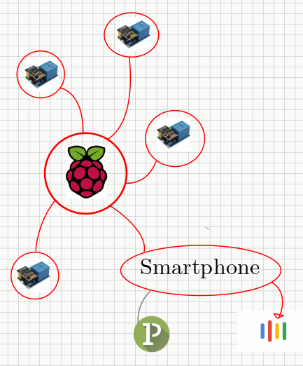
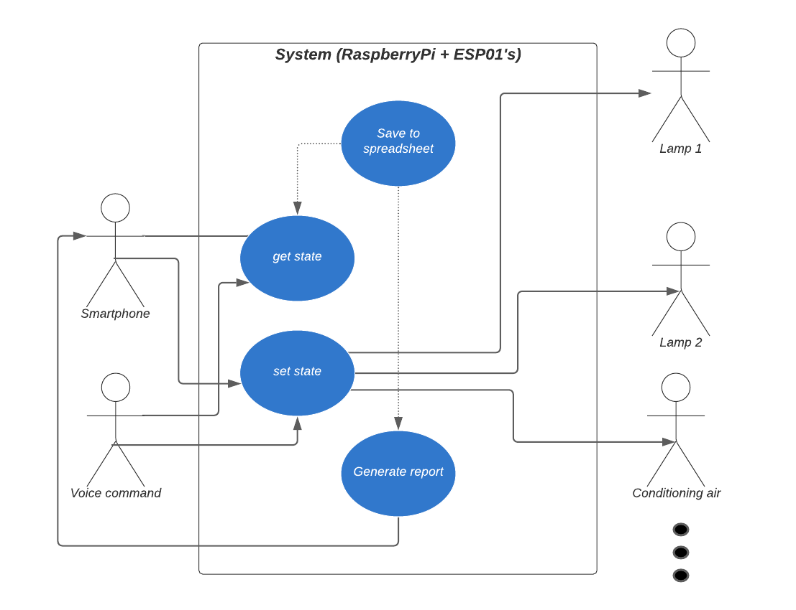

# Table of Contents

1.  [Motivação](#orga550b32)
2.  [Objetivos](#orgef90666)
3.  [Detalhamento do projeto](#org2e55bbd)
    1.  [Lâmpadas](#org92738be)
        1.  [Descrição do circuito](#org44f8658)
        2.  [Componentes utilizados (por lâmpada)](#orgece5fd4)
    2.  [Descrição do software](#org33a0603)
        1.  [Conectividade e gerenciamento de ações](#orgb322ebd)
        2.  [GUI](#orgda621d5)
        3.  [Geração de relatórios](#org06894cc)

# Motivação

Um projeto de automação residencial foi demandado. Primeira coisa que vem em mente é poder controlar as lâmdas de casa individualemente como meio de gerenciar o uso de cargas residenciais, viabilizando a economia de energia elétrica. Assim, pretende-se usar um módulo de ESP01 com relé (vide figura \ref{fig:module_esp01}) para cada ponto de interruptor de lâmpada para poder ter conexão com o computador central (raspberry pi).

# Objetivos

Gerenciar o funcionamento das lâmpadas de casa, cujo funcionamento deve ser por comando de voz ou de forma manual. Este gerenciamento também inclui a formação de relatórios sobre consumo elétrico (estimado) em cada dispositivo, apresentando as informações em histogramas.

# Detalhamento do projeto

## Lâmpadas

### Descrição do circuito

Um pequeno trafo recebe a energia da tomada, é retificada por uma ponte retificadora e então o módulo relé com o esp8266 controla o chaveamento da lâmpada. Para fazer o controle da lâmpada ser manual torna-se necessário detectar a existência de fase no pino Normalmente Aberto (NA) do relé, como na figura \ref{fig:tomada}.

Não é intenção deste projeto confeccionar placa de circuito impresso para simplificar o projeto e também no momento é impossível para mim imprimir sem uma impressora adequada.

### Componentes utilizados (por lâmpada)

-   [X] 1 Trafo de carregador;
-   [X] 4 Diodos 1n4007;
-   [X] 1 Capacitor eletrolítico (47uF);
-   [X] 1 Capacitor cerâmico (100nF);
-   [X] 1 Sensor piroelétrico
-   [X] 1 Módulo de acionamento de relé por ESP8266 (figura \ref{fig:module_esp01};
-   [X] 2 transistores de uso geral para para detecção de fase;
-   [X] Resistores diversos
-   [ ] 1 Interruptor paralelo

O módulo de relé possui o esquemático como na figura \ref{schematic_relay}

## Descrição do software

O projeto de software é dividor em 3 partes: Conectividade e gerenciamento de ações; GUI; geração de relatórios

### Conectividade e gerenciamento de ações

Esta parte consiste em fazer os ESP8266 se conectarem com o raspberryPI por rede para estabelecer comunicação (vide figura \ref{fig:lan_concept}) e também consiste nas tomadas de decisão para o raspberryPI, determinando o comportamento de cada lâmpada e dando prioridade aos comandos.
Os esp8266 das tomadas devem entrar em um ponto de acesso central e então ficar à espera de comandos. Ele age como escravo para responder aos comandos do computador central.

-   Atividades de pesquisa e implementação:
    -   Protocolo de comunicação (http)
        -   Usar os esps como servidores, de modo que o raspberry consiga solicitar informações e obter respostas
        -   TCP sockets on raspberry PI
    -   Secure shell (ssh) para compartilhar tela
        -   Pesquisar no site da raspberry PI foundation
    -   Reconhecimento de voz
        -   Aprender a interligar o raspberryPI com celular (pacotes TCP)
        -   Smart Home with Google Assistant & Alexa using NodeMCU ESP8266
-   Programação dos ESP8266
    -   framework: micropython
    -   Micropython: [<https://docs.micropython.org/en/latest/esp8266/tutorial/intro.html>]
    -   TCP sockets on micropython [<https://docs.micropython.org/en/latest/esp8266/tutorial/network_tcp.html>]
-   Procedimentos a serem utilizados na cpu principal:
    -   get state() # Retorna o estado atual lâmpada;
    -   turn(boolean state) # Pede para ligar/desligar a lâmpada
    -   get switch() # Retorna a posição do interruptor;
    -   get phase() # Retorna valor para identificar quais ramos estão conectados à fase

### GUI

Uma interface gráfica para o usuário como a da figura \ref{fig:gui} é tida como meio de centralizar as informações de forma que fique acessível ao usuário. Esta será feita no raspberryPI IOs com a biblioteca Qt for python, que é uma versão alternativa ao PyQt com licensa LGPL, para caso o projeto futuramente se torne comercial.

-   Atividades de pesquisa e implementação
    -   Aprender a criar um layout básico, gereciamento de widgets&#x2026;
    -   Aprender a embarcar um canvas
    -   Aprender a criar classe que filiada ao Qt for python

TODO!!!

### Geração de relatórios

Esta parte do projeto consiste em trabalhar com as informações obtidas com as lâmpadas, visa calcular consumos e gerar um histrograma para o consumo de energia dos dispositivos.

-   Atividades de pesquisa e implementação
    -   Aprender a criar histogramas;
    -   Aprender manipular os parâmetros de gráficos;
    -

